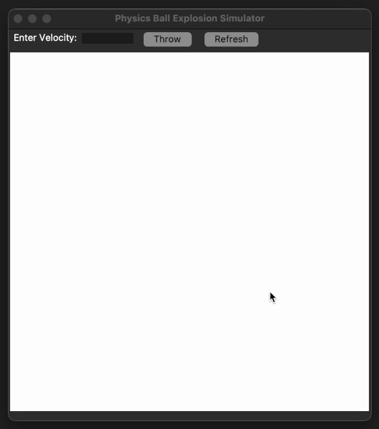

# Demo



During the recent development of "vibe-coding," I wanted to continue to refine my raw-skills. 
This project is the first iteration of my "NO-AI" projects to continue developing my personal skills.


# Physics Ball Explosion Simulator

A Python-based physics simulation that demonstrates ball movement, collisions, and explosions using Tkinter.

## Features

- Realistic physics simulation with gravity and elastic collisions
- Interactive velocity input
- Explosion effects based on impact velocity
- Ball-to-ball collision detection and response
- Energy loss through bounce damping

## Requirements

- Python 3.x
- Tkinter (usually comes with Python)

## Installation

1. Clone the repository:
```bash
git clone https://github.com/baasilali/explosions.git
cd explosions
```

2. Run the simulation:
```bash
python explosions.py
```

## Usage

1. Enter a velocity value in the text field
2. Press Enter or click the "Throw" button to launch the ball
3. Watch the ball explode upon impact with the wall
4. Use the "Refresh" button to reset the simulation

## Physics Implementation

The simulation implements:
- Gravity effects
- Elastic collisions between balls
- Wall bouncing with energy loss
- Velocity-based explosion particle generation
- Particle-to-particle collisions
